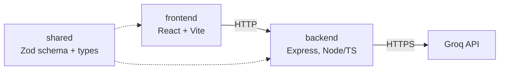

# AI Career Assistant
 
Upload a CV (PDF) and paste a job description, and get back a structured fit report:
matched requirements, missing requirements, seniority alignment, a short fit summary,
and a suitability score (1-10) with the reasoning behind it.
 
## Requirements
 
- Node.js 20+
- A [Groq](https://console.groq.com) API key

## Setup
 
```bash
npm install
```
 
This also builds the `shared` package automatically (via `postinstall`), which the
backend depends on.
 
Then create your backend env file:
 
```bash
cp backend/.env.example backend/.env
```
 
Edit `backend/.env` and add your Groq API key:
 
```
PORT=4000
GROQ_API_KEY=your_groq_api_key_here
GROQ_MODEL=openai/gpt-oss-120b
```
 
## Running it
 
In two separate terminals:
 
```bash
npm run dev:backend    # http://localhost:4000
npm run dev:frontend   # http://localhost:5173
```
 
The frontend dev server proxies `/api/*` requests to the backend, so just open
`http://localhost:5173` and use the app from there.
 
## Running tests
 
```bash
npm run test:backend
```
 
## Architecture
 

 
- **`frontend/`** — a single-page React app. Upload a CV, paste a JD, render the
  structured report.
- **`backend/`** — one route (`POST /api/analyze`). Validates the upload and JD text,
  extracts CV text from the PDF, builds the prompt, calls Groq, validates and returns
  the report. No database — nothing needs to persist between requests for this MVP.
- **`shared/`** — the `Report` type and its Zod schema, plus the request/response
  contract, built once and imported by both other packages so the frontend and backend
  can't drift out of sync on what a "report" looks like.
Request flow: the frontend does light client-side validation (file present, PDF type,
JD non-empty) purely to avoid a wasted round trip, then POSTs multipart form data. The
backend re-validates everything server-side (this is the real boundary, not the
client-side one) — CV MIME type and size via multer's `fileFilter`, JD text via a
shared Zod schema — before touching PDF parsing or the AI call at all. The AI call
itself has its own retry: one retry on a malformed/invalid response, no retry if the
model explicitly says the input isn't a usable CV/JD pair. Any unexpected error is
routed through Express's error middleware rather than left to crash the process.
 
## RAG/LLM approach & decisions
 
**No RAG, no vector DB.** A single CV and a single JD are both small enough (a few
pages of text) to pass directly into the model's context — there's no corpus to
retrieve from, nothing to chunk or embed. Retrieval earns its complexity when you're
searching across many documents; this is a 1:1 comparison. If a future version needed
to compare one CV against a large bank of postings, that's where a vector DB would
actually pay for itself.
 
**LLM provider:** Groq, currently running `openai/gpt-oss-120b`, behind a small
`AiProvider` interface so swapping providers is a one-class change, not a rewrite.
 
**Prompt design:** one system prompt containing the output contract, extraction rules,
and scoring rubric, plus 2 short worked examples (a strong match, a weak match and a partial match)
to anchor the exact JSON shape and both ends of the scoring range. Judgment calls —
tiering requirements as must-have vs nice-to-have, matching on meaning rather than
exact keywords, handling soft JD language ("ideally", "though we can teach this"),
extracting requirements written as prose rather than bullets — are taught through
explicit rules in the prompt rather than through example volume. The whole system
prompt is a single static prefix and the user message is 100% the real JD/CV content,
which also lines up with Groq's automatic prompt caching (it caches on exact prefix
matches).
 
**Output validation:** the model is instructed to return only JSON matching the
`Report` shape, and that's validated against the same Zod schema shared with the
frontend before it goes anywhere. If the response fails to parse, fails schema
validation, or the provider call itself errors, it's retried once with the same
prompt; if that also fails, the request fails with a clean error rather than passing
through something malformed.
 
**Working within Groq's free-tier limits.** This ended up being a real constraint, not
a footnote. `gpt-oss-120b` is a reasoning model — it generates hidden "thinking"
tokens before its visible answer, and those count against the output token budget.
Early on, too small a `max_tokens` value (set to protect the overall per-minute token
limit) let the model exhaust its entire budget on reasoning and return nothing at all,
which surfaces from Groq as an opaque JSON-validation error with no useful detail. The
fix was two-sided: a documented `reasoning_effort: "low"` parameter to keep the hidden
reasoning budget small, combined with raising `max_tokens` enough to actually fit
reasoning plus the real output. On top of that, both the JD and CV text are hard-capped
in length (`MAX_JD_CHARS` / `MAX_CV_CHARS`, 3,000 characters each), and the few-shot
examples were deliberately kept short rather than long/realistic, specifically to keep
a single request comfortably under the account's token-per-minute ceiling.
 
**Guardrails, quality, observability:** schema validation is the main guardrail — any
response that doesn't match the exact `Report` shape never reaches the user. Quality
beyond that currently rests on rubric being explicit about what earns which score band,
rather than left implicit. Observability is minimal by design for this MVP: structured `console.error`
logging on any AI-response parse/validation failure (including the raw response and
the exact validation issues, so a real failure is debuggable rather than a silent
"something went wrong") — no request tracing, no metrics, no log aggregation.
 
## Key technical decisions and why
 
- **Monorepo with a shared types package**, not two separate repos and not duplicated
  types. A change to the report shape becomes a compile error in both frontend and
  backend instead of a silent runtime mismatch.
- **No persistence.** Nothing in the brief needs data to survive between requests, so
  there's no database. Worth naming as a decision rather than a gap — see
  productionization below for what changes if that stops being true.
- **PDF only for CV upload.** CVs are naturally PDF files people already have saved;
  supporting more formats wasn't worth the time against the rest of the brief.
- **Free text only for the job description**, not a link-fetch option. A link-fetch
  path was actually built and then removed after testing showed it was unreliable
  against real job sites — LinkedIn blocked the request outright, and even sites that
  don't block outright vary wildly in HTML structure and often render the actual
  content client-side in JavaScript, which a server-side fetch can't see. Free text
  works identically regardless of source, since the user has already gotten past
  whatever wall exists by having the text in front of them.
- **Must-have vs nice-to-have tiering** on every requirement, not a flat matched/missing
  list. It makes the score defensible — you can see why something scored a 3 vs a 7 by
  which tier the misses fall in — and maps onto how job descriptions are usually
  written anyway.

## Engineering standards followed (and skipped)
 
Followed:
- TypeScript throughout, strict mode on.
- Schema validation at every trust boundary: the AI response, and the incoming request
  fields.
- Unit tests (19, via Vitest) on the parts most likely to silently break: schema
  validation, and the parse/retry logic in `analysisService` using a fake `AiProvider`
  so tests don't depend on a real API call — including the provider-error retry path
  specifically, since that's where a real bug (an unhandled promise rejection crashing
  the whole process on certain Groq errors) was caught and fixed.
- No secrets committed — `.env` is gitignored, `.env.example` shows what's needed.
Skipped, deliberately, given take-home scope:
- No integration/e2e tests against a real Express server or a real Groq call.
- No rate limiting or auth on the API.
- No CI pipeline.
- No Dockerfile.

## How I used AI tools in building this
 
I used Claude throughout — to think through requirements before writing code (scope
trade-offs, what fields the report needs, whether this needed RAG at all), to scaffold
the repo structure and schema from those decisions, and to debug real issues that came
up against Groq's actual API: a deprecated model name, free-tier rate limits, and the
process-crashing bug mentioned above. The prompt and its examples went through several
rounds of me pushing back on quality before landing where they are — an early
few-shot design was too expensive against the account's rate limits and got
re-engineered down to 3 short examples instead of longer ones; an early "partial match"
example scored too close to the weak-match example and got reworked so it actually sat
in the middle of the range; another early example had the CV explicitly stating what
skills were *absent*, which doesn't read like a real CV, so that got rewritten to omit
mentioning them at all, the way an actual CV would.
 
Did:
- Use it to move fast on scaffolding and boilerplate once the design was decided.
- Have it explain *why* it made a call, so I'm not shipping code I can't defend.
Didn't:
- Let it make product-scope decisions without me in the loop.
- Take a first draft of a prompt or scoring example as final — it can look plausible
  and still be subtly wrong (see the middle-ground scoring example above).

## Productionizing this
 
- **Persistence:** move from in-memory to Postgres if reports need to be saved, plus
  object storage for uploaded CVs if we want to keep them.
- **Auth & rate limiting:** currently neither exists. Would add both before this is
  public, given every request triggers a paid Groq call.
- **Deployment:** containerize both services (no Dockerfile exists yet — a real gap),
  run them behind a load balancer, static frontend served separately from the API.
- **Secrets:** the Groq key moves from a local `.env` file to a proper secrets manager.
- **Observability:** structured logging shipped somewhere aggregatable, plus tracing
  specifically on the LLM call (prompt/response/latency/token counts) so a bad report
  is debuggable after the fact, not just visible as a console log at request time.
- **Scaling:** the app is stateless per request already, so horizontal scaling is
  straightforward once it's behind a load balancer — the real constraint becomes the
  AI provider's own rate limits rather than anything in this codebase.

## What I'd do differently with more time
 
- Add the extra report fields considered but cut for scope (tailoring suggestions, an
  interview-prep angle) as a genuinely optional second pass.
- A Dockerfile and CI pipeline, so correctness doesn't depend on remembering to run
  lint/test/build locally before every commit.
- Support `.docx` CVs, since not every real candidate will have a PDF handy.

## Notes
 
- CV upload only supports PDF, capped at 5MB.
- The job description is pasted as free text (no file upload or link-fetching).
- `GROQ_MODEL` can be changed to any Groq-hosted chat model.
- AI calls go through a small provider-agnostic interface (`AiProvider`), so swapping
  Groq for another provider (e.g. Claude, OpenAI) is a matter of writing one new class,
  not changing how the rest of the app calls it.